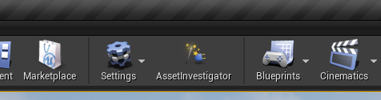
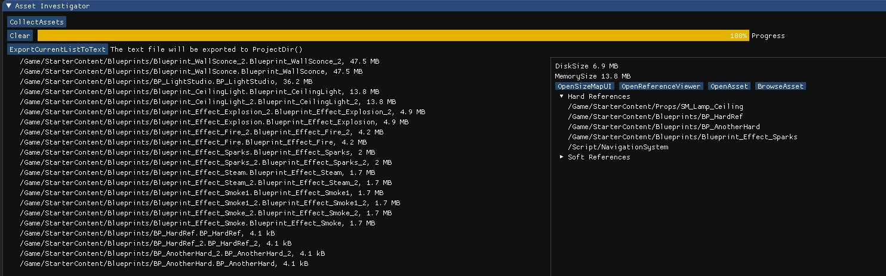

## **Unreal Engine 4 Asset Investigator Module**

Overview
The Asset Investigator Module is a plugin for Unreal Engine 4 (UE4) that provides a comprehensive set of tools for managing and analyzing assets within the UE4 editor. This module allows users to explore, and inspect assets, aiding in tasks such as identifying memory usage, exploring asset dependencies, and more.

## Usage

Install the Asset Investigator Module in your UE4 project.
Access the module functionalities through the UE4 editor's menus and toolbar.
Utilize the provided UI and buttons to collect and analyze asset information.
Export asset information to a text file for further analysis or documentation.

## How to use

 - Make sure that you also have another plugin that is made based on Imgui plugin by @sunpeng1995 from https://github.com/sunpeng1995/UnrealImGui/tree/editor-use which specifically works with Unreal Engine editor
 - Download UEAssetInvestigator
 - Put them in the Plugin folder

***Compatibility 
UE4 4.27.2***

